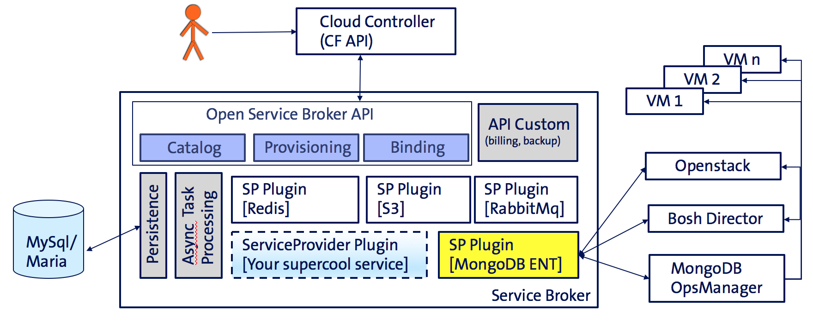
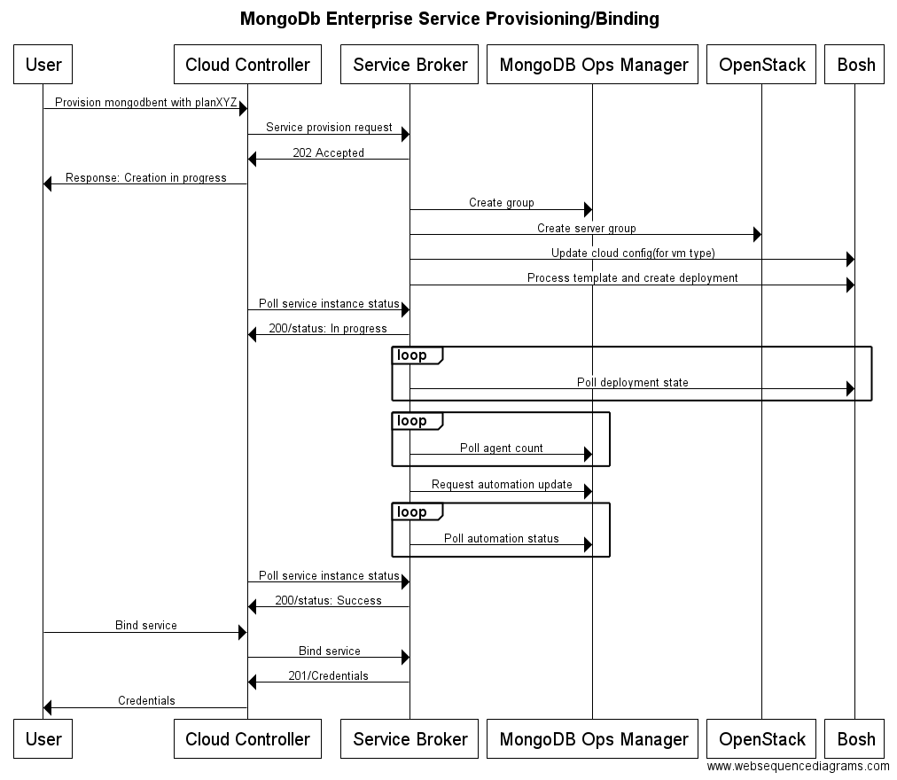
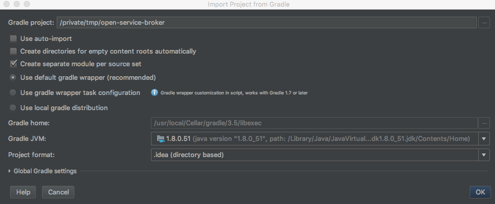

# Open Service Broker

### Status

Master Branch: [](https://circleci.com/gh/swisscom/open-service-broker/tree/master)

Develop Branch: [](https://circleci.com/gh/swisscom/open-service-broker/tree/develop)

broker: [  ](https://bintray.com/swisscom/open-service-broker/broker/_latestVersion)

core: [  ](https://bintray.com/swisscom/open-service-broker/core/_latestVersion)

model: [  ](https://bintray.com/swisscom/open-service-broker/model/_latestVersion)

client: [  ](https://bintray.com/swisscom/open-service-broker/client/_latestVersion)

## Introduction

Open Service Broker is an implementation of the [Open Service Broker API](https://github.com/openservicebrokerapi/servicebroker/blob/v2.11/spec.md). It enables platforms such as [Cloud Foundry](https://www.cloudfoundry.org/) & [Kubernetes](https://kubernetes.io/) to provision and manage services.

Open Service Broker is built in a modular way and one service broker can host multiple services.

Service broker offers extra functionality regarding Billing, Backup/Restore on top of the Open Service Broker API.

Services can be provisioned synchronously and/or asynchronously and the goal of this project is to provide a framework with which any service can easily be provisioned.  

The image above shows the high level architecture.

The following flow chart shows interactions for service provisioning and service binding for MongoDB Enterprise service.



## Development

### Prerequisites

- Java 1.8
- MySQL / MariaDB Server


## Deployment
### Build

Build Service Broker using the `gradlew` script in the root directory of the repository.

```bash
$ ./gradlew clean build -x test -x integrationTest -x functionalTest -Ptomcat
```

The parameter called _tomcat_ is for controlling if a tomcat runtime is integrated into the war.

Command below gives you a self executable jar 
```bash
$ ./gradlew clean build -x test -x integrationTest -x functionalTest 
```

### Environment

To execute tests or run the Service Broker locally, docker-compose can be used to spin up all required systems.
```bash
$ cd docker
$ docker-compose up -d
``` 

Configurations for test purposes with the docker-compose environment can be put into [broker/src/main/resources/application-test.yml](https://github.com/swisscom/open-service-broker/blob/develop/broker/src/main/resources/application-test.yml). The profile can be activated by annotating the test class with `@ActiveProfiles("info,default,extensions,secrets,test")`.

#### Database

To run the service broker locally a mariadb or mysql database with name _CFbroker_ is required.
The database tables will be generated automatically by the application. See the configuration section for more details.

### Run

To run the built artifact, from the root directory the following commands can be executed:
```bash
java -jar -Dspring.config.additional-location=file:/some/path/servicebroker.yml broker/build/libs/service-broker-2.0.0-SNAPSHOT.war 
```
The config file passed can overwrite any default values. Providing an external config file is optional and when no external config file is provided, the default values are dictated by application.yml file(s).

or

```bash
./gradlew broker:bootRun
```

At the time being, Service Broker is recommended to run with only one instance to avoid concurrency issues.
This issue will be fixed soon.

### Openshift Deployment
For installing Service Broker on Openshift, use the *openshift-deploy.sh* script. This script creates a new MariaDB instance and provisions a new Service Broker instance & configures SB to use the newly created DB.

### IDE/IntelliJ
When importing this project into IntelliJ, select the "create separate module per source set option".


### Cloud Foundry interactions

Follow the [documentation](http://docs.cloudfoundry.org/services/managing-service-brokers.html) to register the broker
to Cloud Foundry.

Before a `cf create-service-broker` or `update-service-broker` call is made, please make sure that Service Broker is configured correctly.
For configuring the catalog, see the service definition section.

### Deploy in Cloud Foundry

It is also supported to host the open service broker as an app in cloudfoundry. The project contains in the root folder 
a 'manifest-template.yml' which contains a default configuration for the cloud foundry deployment.
During the build the template file is being processed and a versioned manifest is created in the %rootdir%/broker/build/libs directory.
To deploy:
* build or ensure the Broker binaries are built
* navigate to the libs folder for the project (where the manifest.yml is)
    * To override configurations, modify environment variable `SPRING_APPLICATION_JSON` in manifest.yml 
* login to cloud foundry with 'cf login ...'
* execute the command 'cf push' which will parse the manifest and upload the application

````bash
    cf login -a https://api.scapp-console.swisscom.com --sso
    cf push
````

[detailed documentation about manifest](https://docs.cloudfoundry.org/devguide/deploy-apps/manifest.html#find-manifest)

### JAVA_OPTS
```bash
JAVA_OPTS="$JAVA_OPTS -Djava.security.egd=file:/dev/./urandom -Djava.awt.headless=true -Xmx2048m -XX:MaxPermSize=1024m -XX:+UseConcMarkSweepGC"
```

## Configuration

The configuration file for the Service Broker is located under

[`broker/src/main/resources/application.yml`](broker/src/main/resources/application.yml)

## Service Definitions

Service definitions are maintained in the application.yml under the serviceDefinitions key. This key expects a list of service definitions as values. 
On startup, the service broker will validate that service definitions from in the database exist in the application.yml configurations based on GUID.
Setting the value of serviceDefinitions to an empty list ([]), will bypass the verification.

### Example Service Definition

Example Service Definition in application.yml configuration file.
```yaml
serviceDefinitions:
- guid: 'udn9276f-hod4-5432-vw34-6c33d7359c12'
  name: 'mongodbent'
  description: 'MongoDB Enterprise HA v3.2.11'
  bindable: true
  asyncRequired: true
  internalName: 'mongoDbEnterprise'
  displayIndex: 1
  tags: []
  metadata:
    version: '3.2.11'
    displayName: 'MongoDB Enterprise'
  plans:
  - guid: 'jfkos87r-truz-4567-liop-dfrwscvbnmk6'
    name: 'replicaset'
    description: 'Replica Set with 3 data bearing nodes with 32 GB memory, 320 GB storage, unlimited concurrent connections'
    templateId: 'mongodbent-bosh-template'
    free: false
    displayIndex: 0
    containerParams:
    - template: ''
      name: 'plan'
      value: 'mongoent.small'
    - template: ''
      name: 'vm_instance_type'
      value: 'mongoent.small'
    metadata:
      storageCapacity: '320GB'
      memory: '32GB'
      nodes: '3'
      maximumConcurrentConnections: 'unlimited'
      dedicatedService: true
      highAvailability: true
      displayName: 'Small'
```


Updating/Creating Service Definitions over the service-definition API (defined below) requires the JSON format like following example.

> **DEPRECATED**: The service-definition API is deprecated and will be removed in future releases

```json
{
    "guid": "udn9276f-hod4-5432-vw34-6c33d7359c12",
    "name": "mongodbent",
    "description": "MongoDB Enterprise HA v3.2.11",
    "bindable": true,
    "asyncRequired": true,
    "internalName": "mongoDbEnterprise",
    "displayIndex": 1,
    "tags": [],
    "metadata": {
      "version": "3.2.11",
      "displayName": "MongoDB Enterprise"
    },
    "plans": [
      {
        "guid": "jfkos87r-truz-4567-liop-dfrwscvbnmk6",
        "name": "replicaset",
        "description": "Replica Set with 3 data bearing nodes with 32 GB memory, 320 GB storage, unlimited concurrent connections",
        "templateId": "mongodbent-bosh-template",
        "free": false,
        "displayIndex": 0,
        "containerParams": [
          {
            "template": "",
            "name": "plan",
            "value": "mongoent.small"
          },
          {
            "template": "",
            "name": "vm_instance_type",
            "value": "mongoent.small"
          }
        ],
        "metadata": {
          "storageCapacity": "320GB",
          "memory": "32GB",
          "nodes": "3",
          "maximumConcurrentConnections": "unlimited",
          "dedicatedService": true,
          "highAvailability": true,
          "displayName": "Small"
        }
      }
    ]
}
```

**_Following endpoints are deprecated_**
### Get service definition
> **DEPRECATED**: The service-definition API is deprecated and will be removed in future releases

Via the example call below, service definitions for a given service id can be retrieved.

```bash
curl -u 'username:password' -X GET 'http://localhost:8080/custom/admin/service-definition/{service_id}'
```

### Add service definition
> **DEPRECATED**: The service-definition API is deprecated and will be removed in future releases

Service Broker provides a way to update service definitions via HTTP calls.

Here is an example:

```bash
curl -u 'username:password' -X POST -H 'Content-Type: application/json' --data-binary '@path/to/definition/file.json' 'http://localhost:8080/custom/admin/service-definition'
```

This interface can be used for both adding a new service or updating an existing one. For an existing service, if a plan that is in use is tried to be removed an exception will be thrown.

### Remove service definition
> **DEPRECATED**: The service-definition API is deprecated and will be removed in future releases

A service and its plan(s), which are not used i.e. which have no service instances, can be removed via a REST interface.
Here is an example for how to delete a service that has the id `service_id`:

```bash
curl -u 'username:password' -X DELETE 'http://localhost:8080/custom/admin/service-definition/{service_id}'
```

## Swagger

The Swagger API documentation can be accessed at <http://localhost:8080/swagger-ui.html>

## Brokered Services
### Bosh based services
Any bosh based service can be easily brokered. See [here](https://github.com/search?q=topic%3Abosh-release+org%3Aswisscom&type=Repositories) for Swisscom's bosh releases.  
Check the class [`BoshBasedServiceProvider`](broker/src/main/groovy/com/swisscom/cloud/sb/broker/services/bosh/BoshBasedServiceProvider.groovy) for details.

#### MongoDB Enterprise
https://github.com/swisscom/mongodb-enterprise-boshrelease

### Kubernetes based services
Any [Kubernetes](http://kubernetes.io) based service can be provisioned with Open Service Broker. The asynchronous task is being created to prepare the provisioning of the service instance. Kubernetes [Facade](https://github.com/swisscom/open-service-broker/blob/develop/broker/src/main/groovy/com/swisscom/cloud/sb/broker/services/kubernetes/facade/KubernetesFacade.groovy) is using the [client](https://github.com/swisscom/open-service-broker/blob/develop/broker/src/main/groovy/com/swisscom/cloud/sb/broker/services/kubernetes/client/rest/KubernetesClient.groovy) to execute a bunch of "templated" HTTP calls on Kubernetes API. All the templates can be read from the `application.yml` and are automatically read inside a specific [ServiceProvider](https://github.com/swisscom/open-service-broker/blob/develop/broker/src/main/groovy/com/swisscom/cloud/sb/broker/services/kubernetes/facade/redis/service/KubernetesRedisServiceProvider.groovy).
     
### OpenWhisk
Open Service Broker can broker your local deployment of OpenWhisk.

Provision will create a new namespace.

An example of the provision json data (Parameters are optional).
```text
cf create-service openwhisk basic my_open_whisk
 
cf create-service openwhisk basic my_open_whisk -c '{"namespace":"NAMESPACE"}'
```
```json
{
    "service_id": "udn9276f-hod4-5432-vw34-6c33d7359c20",
    "plan_id": "jfkos87r-truz-4567-liop-dfrwscvbnm20",
    "parameters": {
        "namespace": "NAMESPACE"
    }
}
```

Binding will create a new subject within the namespace.

An example of the bind json data (Parameters are optional).
```text
cf bind-service my_app my_open_whisk
 
cf bind-service my_app my_open_whisk -c '{"subject":"SUBJECT"}'
```
```json
{
    "service_id": "udn9276f-hod4-5432-vw34-6c33d7359c20",
    "plan_id": "jfkos87r-truz-4567-liop-dfrwscvbnm20",
    "parameters": {
        "subject": "SUBJECT"
    }
}
```

Binding will return the HOST, UUID, and KEY. With these credentials, you can configure your local OpenWhisk CLI.
```text
wsk property set --apihost HOST --auth UUID:KEY
```

As the OpenWhisk API does not provide the create/update/delete functionality that we were hoping for, we perform CRUD namespace/subject directly into the CouchDB.

### Eden

[Eden](https://github.com/starkandwayne/eden) is a CLI to interact with any Open Service Broker API. 
All operations of the API are supported: discover/provision/bind/unbind/deprovision. 
After [installing Eden](https://github.com/starkandwayne/eden#installation) you can use the following commands to interact with your broker:
```
export SB_BROKER_URL=http://localhost:8080 && export SB_BROKER_USERNAME=cc_admin && export SB_BROKER_PASSWORD=change_me
eden catalog
eden provision -s redis -p small -i test_redis
```
Before you are able to run these commands above make sure to have Open Service Broker running and desired service definitions got published.

### Logging
The logging is based on [Slf4j](https://www.slf4j.org/) with the [Log4J2 Extension](https://logging.apache.org/log4j/2.0/log4j-slf4j-impl/). The log output can be modified with the default [log4j2 configuration](https://logging.apache.org/log4j/2.x/manual/configuration.html) methods (e.g. log4j2.properties, log4j2.yaml ...).
The default configuration returns a compacts json format with every item on a single line.

to allow local logging in human readable format the following files have been added to .gitIgnore:
**log4j2-test*

so that a file with log4j2-test.yaml can be added. To have a normal human readable output, use:
```
   status = error
   dest = err
   name = PropertiesConfig
   
   appender.console.type = Console
   appender.console.name = STDOUT
   appender.console.layout.type = PatternLayout
   appender.console.layout.pattern=%d{yyyy-MM-dd HH:mm:ss} %-5p %c{1}:%L - %m%n
   
   rootLogger.level = info
   rootLogger.appenderRef.stdout.ref = STDOUT
```

## Admin Actions

Admin actions allow you to modify the behaviour of the open service brokers internals. admin actions are designed to 
remedy or change errorous states in the broker due to manual interactions on the service level.

Admin actions are not for the default user and therefor are only usable with users with ext permission.

### Terminate LastOperation

```
[POST] /admin/service_instances/{serviceInstanceGuid}/last_operation/terminate
```

This will stop all scheduled actions for this service and set the current last action to failed. This command should be
used if a service creation has failed without aprioriate feedback or if the broker isn't in sync anymore.