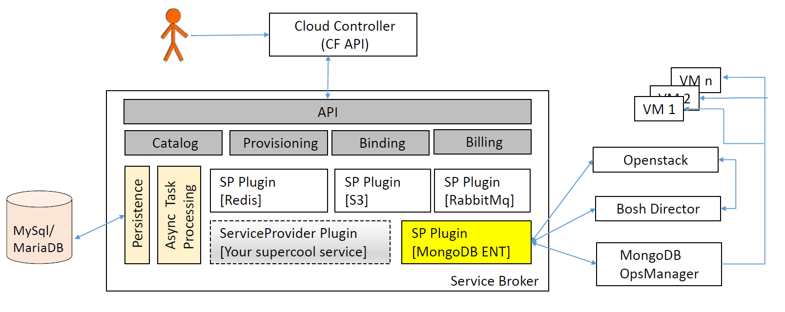

# Open Service Broker

### Status
Develop Branch:[](https://travis-ci.org/swisscom/open-service-broker)
## Introduction

Open Service Broker is an implementation of the [Open Service Broker API](https://github.com/openservicebrokerapi/servicebroker/blob/v2.11/spec.md). It enables platforms such as [Cloud Foundry](https://www.cloudfoundry.org/) & [Kubernetes](https://kubernetes.io/) to provision and manage services.

Open Service Broker is built in a modular way and one service broker can host multiple services.

Service broker offers extra functionality regarding Billing, Backup/Restore on top of the Open Service Broker API.

Services can be provisioned synchronously and/or asynchronously and the goal of this project is to provide a framework with which any service can easily be provisioned.  

The image above shows the high level architecture.

The following flow chart shows interactions for service provisioning and service binding for MongoDB Enterprise service.


## Development

### Prerequisites

- Java 1.8
- MySQL / MariaDB Server


## Deployment
### Build

Build Service Broker using the `gradlew` script in the root directory of the repository.

```bash
$ ./gradlew clean build -x test -x integrationTest -x functionalTest -Ptomcat
```

The parameter called _tomcat_ is for controlling if a tomcat runtime is integrated into the war.

Command below gives you a self executable jar 
```bash
$ ./gradlew clean build -x test -x integrationTest -x functionalTest 
```


### Database

To run the service broker locally a mariadb or mysql database with name _CFbroker_ is required.
The database tables will be generated automatically by the application. See the configuration section for more details.

#### Use Docker for MariaDB setup
```bash
docker run --name appc-cf-service-broker-db -e MYSQL_DATABASE=CFBroker -e MYSQL_ALLOW_EMPTY_PASSWORD=yes -p 3306:3306 -d mariadb
```

### Run

To run the built artifact, from the root directory the following commands can be executed:
```bash
java -jar -Dspring.config.location=file:/some/path/servicebroker.yml broker/build/libs/service-broker-2.0.0-SNAPSHOT.war 
```
The config file passed can overwrite any default values. Providing an external config file is optional and when no external config file is provided, the default values are dictated by application.yml file(s).

or

```bash
./gradlew broker:bootRun
```

At the time being, Service Broker is recommended to run with only one instance to avoid concurrency issues.
This issue will be fixed soon.

### IDE/IntelliJ
When importing this project into IntelliJ, select the "create separate module per source set option".


### Cloud Foundry interactions

Follow the [documentation](http://docs.cloudfoundry.org/services/managing-service-brokers.html) to register the broker
to Cloud Foundry.

Before a `cf create-service-broker` or `update-service-broker` call is made, please make sure that Service Broker is configured correctly.
For configuring the catalog, see the service definition section.

### JAVA_OPTS
```bash
JAVA_OPTS="$JAVA_OPTS -Djava.security.egd=file:/dev/./urandom -Djava.awt.headless=true -Xmx2048m -XX:MaxPermSize=1024m -XX:+UseConcMarkSweepGC"
```

## Configuration

The configuration file for the Service Broker is located under

[`broker/src/main/resources/application.yml`](broker/src/main/resources/application.yml)

## Service Definitions

### Get service definition

Via the example call below, service definitions for a given service id can be retrieved.

```bash
curl -u 'username:password' -X GET 'http://localhost:8080/custom/admin/service-definition/{service_id}'
```

### Add service definition

Service Broker provides a way to update service definitions via HTTP calls.

Here is an example:

```bash
curl -u 'username:password' -X POST -H 'Content-Type: application/json' --data-binary '@path/to/definition/file' 'http://localhost:8080/custom/admin/service-definition'
```

This interface can be used for both adding a new service or updating an existing one. For an existing service, if a plan that is in use is tried to be removed an exception will be thrown.

### Remove service definition

A service and its plan(s), which are not used i.e. which have no service instances, can be removed via a REST interface.
Here is an example for how to delete a service that has the id `service_id`:

```bash
curl -u 'username:password' -X DELETE 'http://localhost:8080/custom/admin/service-definition/{service_id}'
```

### Example Service Definition

```json
{
  "guid": "udn9276f-hod4-5432-vw34-6c33d7359c12",
  "name": "mongodbent",
  "description": "MongoDB Enterprise HA v3.2.11",
  "bindable": true,
  "asyncRequired": true,
  "internalName": "mongoDbEnterprise",
  "displayIndex": 1,
  "tags": [],
  "metadata": {
    "version": "3.2.11",
    "displayName": "MongoDB Enterprise"
  },
  "plans": [
    {
      "guid": "jfkos87r-truz-4567-liop-dfrwscvbnmk6",
      "name": "replicaset",
      "description": "Replica Set with 3 data bearing nodes with 32 GB memory, 320 GB storage, unlimited concurrent connections",
      "templateId": "mongodbent-bosh-template",
      "free": false,
      "displayIndex": 0,
      "containerParams": [
        {
          "template": "",
          "name": "plan",
          "value": "mongoent.small"
        },
        {
          "template": "",
          "name": "vm_instance_type",
          "value": "mongoent.small"
        }
      ],
      "metadata": {
        "storageCapacity": "320GB",
        "memory": "32GB",
        "nodes": "3",
        "maximumConcurrentConnections": "unlimited",
        "dedicatedService": true,
        "highAvailability": true,
        "displayName": "Small"
      }
    }
  ]
}
```

## Swagger

The Swagger API documentation can be accessed at <http://localhost:8080/swagger-ui.html>

## Brokered Services
### Bosh based services
Any bosh based service can be easily brokered. See [here](https://github.com/search?q=topic%3Abosh-release+org%3Aswisscom&type=Repositories) for Swisscom's bosh releases.  
Check the class [`BoshBasedServiceProvider`](broker/src/main/groovy/com/swisscom/cloud/sb/broker/services/bosh/BoshBasedServiceProvider.groovy) for details.

#### MongoDB Enterprise
https://github.com/swisscom/mongodb-enterprise-boshrelease

### Kubernetes based services
Any [Kubernetes](http://kubernetes.io) based service can be provisioned with Open Service Broker. The asynchronous task is being created to prepare the provisioning of the service instance. Kubernetes [Facade](https://github.com/swisscom/open-service-broker/blob/develop/broker/src/main/groovy/com/swisscom/cloud/sb/broker/services/kubernetes/facade/KubernetesFacade.groovy) is using the [client](https://github.com/swisscom/open-service-broker/blob/develop/broker/src/main/groovy/com/swisscom/cloud/sb/broker/services/kubernetes/client/rest/KubernetesClient.groovy) to execute a bunch of "templated" HTTP calls on Kubernetes Server. All the templates are automatically read from provided directory and matched with k8s endpoint.     
     


